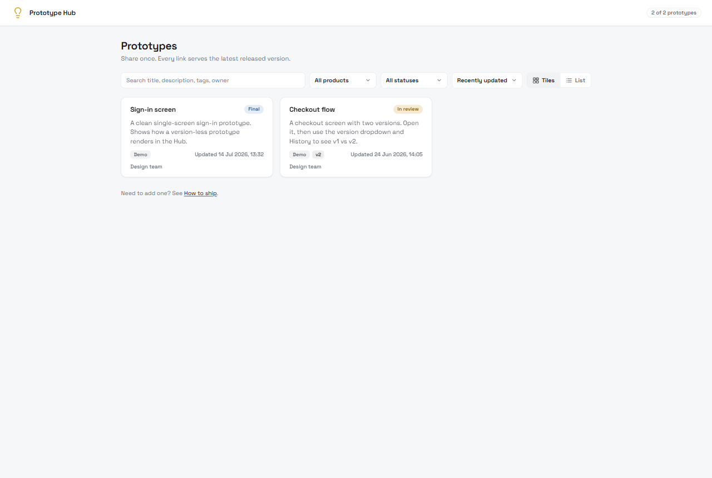
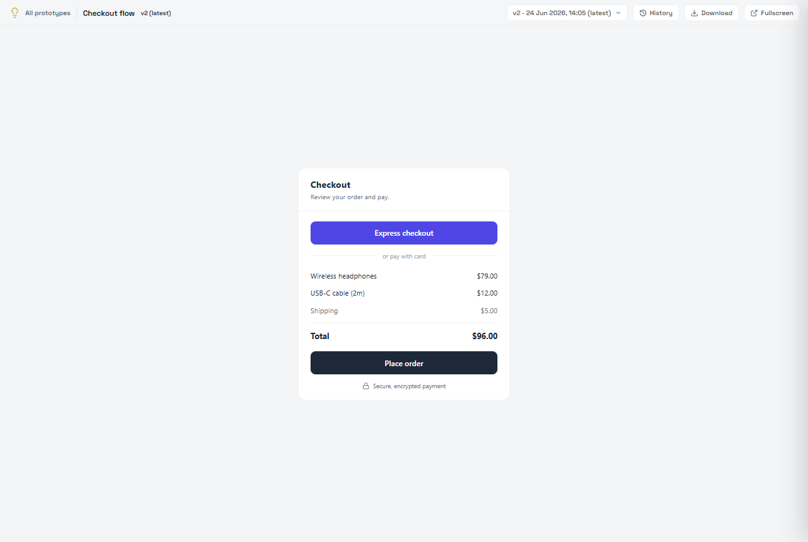

# Prototype Bucket

A tiny, self-hostable portal for your HTML prototypes. One stable link per prototype, with
version history and a changelog. Ship a new version and the link updates itself, so you never
re-share a link. It renders your HTML the way an artifact viewer does: in a clean iframe with
a chrome bar.

**Zero dependencies. No build tooling. No database.** A handful of plain Node files plus your
HTML. Run it as a small server, or export a static site and host it anywhere.



Open any prototype and you get a stable link, a version dropdown, and a changelog:



## Why

You build one-off HTML prototypes and specs and need to share them with people who should not
have to clone a repo or run anything. Emailing files means stale links and "which version was
that again?". Prototype Bucket gives each prototype a permanent URL, keeps every version, and
shows a plain-language changelog, all from a folder of HTML.

## Quick start

Needs [Node.js](https://nodejs.org) 18 or newer. Nothing else.

```bash
git clone <your-fork-url> prototype-hub
cd prototype-hub

# Option A: run it as a live server
node server.js                 # -> http://localhost:5050

# Option B: build a static site you can host anywhere
node build.js                  # -> ./dist
```

Open the gallery and you will see two demo prototypes. Replace them with your own.

## Add your own prototype

```bash
node new.js checkout-redesign "Checkout redesign"   # scaffolds prototypes/checkout-redesign/
# edit prototypes/checkout-redesign/index.html and meta.json
node release.js checkout-redesign "v1: first pass"  # snapshot + changelog note
```

Full authoring guide: [docs/authoring.md](docs/authoring.md). The one rule for prototypes is
that they must be self-contained: [docs/packaging-standard.md](docs/packaging-standard.md).

## Deploy

Two shapes, same pages. Pick whatever fits your setup.

| You want to host on... | Use | How |
|------------------------|-----|-----|
| Netlify, Vercel, GitHub Pages, Cloudflare, S3, nginx | **static** (`node build.js`) | config files for the first three are already in the repo |
| Your own box, Render, Railway, Fly | **server** (`node server.js`) | any host that runs a Node process |
| Docker / docker compose | **server** | `docker compose up -d` |
| Kubernetes | **server** | Helm chart in `deploy/helm/` |

Step-by-step for each: [deploy/README.md](deploy/README.md).

## Make it yours (white-label)

All branding lives in one file, `hub.config.json`. No code edits.

| Field | What it does |
|-------|--------------|
| `name` | Site name (top bar, page titles) |
| `mark` | 1 to 2 characters in the square brand badge |
| `tagline` | Line under the gallery heading |
| `brandColor` | Any hex. Light tints are derived from it automatically |
| `timezone` | IANA name (e.g. `America/New_York`) for displayed dates |
| `basePath` | `/repo-name` for a GitHub Pages project site; `""` for root hosting |
| `font.family` / `font.cssUrl` | Web font. Set `cssUrl` to `""` for a system-font, fully-offline build |

Any of these can also be set with an env var in CI (`HUB_NAME`, `HUB_BRAND_COLOR`,
`HUB_BASE_PATH`). See `.env.example`.

## How it works

`server.js` and `build.js` both render through `lib/render.js`, so the live server and the
static export are the same pages. Each release copies the working `index.html` into an
immutable `versions/v<N>/` snapshot, so every old version stays permanently renderable with no
runtime dependencies. Details: [docs/architecture.md](docs/architecture.md).

## Access control

No login by design: anyone who can reach it sees every non-draft prototype. That is right for
an internal network or a host with its own access control. For the server, set
`HUB_BASIC_AUTH=user:pass` to gate the whole site. For static hosting, use your host's
protection (Netlify password, Cloudflare Access, a private bucket). Do not put confidential
prototypes on an unprotected public URL.

## Optional: Claude Code skill

If you use [Claude Code](https://claude.com/claude-code), `examples/claude-skill/` adds a
`/ship-prototype` command that packages the prototype you just built and adds it to the Hub in
one step. Everyone else adds prototypes with the `node` commands above; the skill is a
convenience, not a requirement.

## License

MIT. See [LICENSE](LICENSE).
